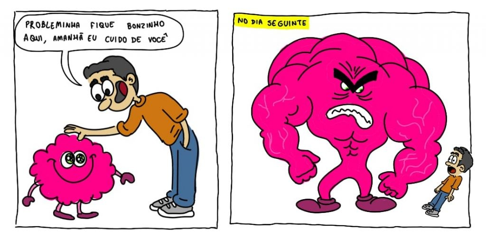

<!-- Perfil: github.com/marcio-dados -->
<!-- Dica: para máxima estabilidade, suba ícones em /assets e troque URLs externas por caminhos locais. -->

<h1 align="center">Márcio Ferreira Junior</h1>

  Python • SQL • DBT • Databricks • Airflow • Power BI • AWS • Azure • Governança de Dados

  
  
  
  
 <!--   -->
  

   

  
🎓 Formação

- **MBAs**: AI & Data Manager; Mineração de Dados & Análise Preditiva; Ciência de Dados & ML  
- **Graduação**: Bacharelado em Ciências Contábeis; Gestão de Negócios  

---
<!-- 
## Estatísticas

  <picture>
    <source srcset="https://github-readme-stats.vercel.app/api?username=marcio-dados&show_icons=true&include_all_commits=true&count_private=true&theme=dark" media="(prefers-color-scheme: dark)" />
    <source srcset="https://github-readme-stats.vercel.app/api?username=marcio-dados&show_icons=true&include_all_commits=true&count_private=true" media="(prefers-color-scheme: light), (prefers-color-scheme: no-preference)" />
    
  </picture>
  <picture>
    <source srcset="https://github-readme-stats.vercel.app/api/top-langs/?username=marcio-dados&layout=compact&langs_count=5&theme=dark" media="(prefers-color-scheme: dark)" />
    <source srcset="https://github-readme-stats.vercel.app/api/top-langs/?username=marcio-dados&layout=compact&langs_count=5" media="(prefers-color-scheme: light), (prefers-color-scheme: no-preference)" />
    
  </picture>

  

---
-->

<!-- ## Conteúdo leve (Tirinhas)
<!-- **BR**  
<!-- BLOG-POST-LIST:START -->
<!-- - [Alegria matinal](https://johnywalves.com.br/comic-29/)
<!-- - [Motivação Criativa](https://johnywalves.com.br/comic-28/)
<!-- - [Escrito por ChatGPT](https://johnywalves.com.br/comic-27/)
<!-- - [Análise profissional](https://johnywalves.com.br/comic-26/)
<!-- - [Lidando com Erros](https://johnywalves.com.br/comic-25/)
<!-- BLOG-POST-LIST:END -->

<!-- 
---

**EN**  

  

---
-->
<a>   </a>
<h3 align="center">
  Newsletter - Fala, Ulisses! 
</h3>

<!-- NEWSLETTER_ULT:START -->
A Segunda Odisseia de Ulisses: Estratégia de Vida e Carreira Depois dos 50 

 

<!-- NEWSLETTER_ULT:END -->

<a>   </a>

<!-- NEWSLETTER_PENULT:START -->
Liderar é Navegar: A Importância dos Marcos na Alta Gestão 

 

<!-- NEWSLETTER_PENULT:END -->
 
  
    Fonte: 
    <a href="https://www.linkedin.com/newsletters/fala-ulisses-7391469228467499008/">
      linkedin.com/newsletters/fala-ulisses
    </a>
  

<a>   </a>
---
<a>   </a>
<h3 align="center">Tirinhas Diárias - pt-br</h3>

<!-- TIRINHA:START -->

 
Fonte: <a href="https://www.tirinhas.com.br/">tirinhas.com.br</a>

<!-- TIRINHA:END -->

